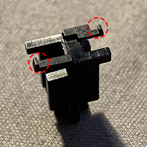

# General Troubleshooting Info

Sometimes when building a keyboard, not everything goes according to plan. Hopefully this document will aid you in diagnosing what exactly went wrong.

## PCB Issues

### **Issue:** My PCB is not being recognized by windows
**Cause:** Several things can cause windows to not properly recognize your device.

1.  A common issue is improper cable/port power. Try a different cable and usb port, that can sometimes be the issue.
    
2.  Another common issue is your pcb being in boot/dfu mode. To check this, unplug your pcb, and check to make sure there is a switch on the back with two positions (generally 0 and 1). Most of the time, position 0 is for use, and 1 is dfu mode. Make sure it’s on 0.
    
3.  Similar to the first issue, a loose connection inside the usb port or a poor solder job on the usb port can cause your PCB to not be recognized. Check your usb port for bridges, or a loose connector. Note: if you’re hand soldering a usb port, it is highly recommended to use flux on the pads. This makes the process much easier.
    
 
### **Issue:** My keypress is not registering

**Cause:** There are some things to check out for hotswap only boards, and some for solder and hotswap boards. 

***Hotswap only issues***

1.  Pull out the switch causing an issue and make sure the pins are not bent on the bottom. If one or both are bent, take some pliers or tweezers and bend them back straight.
    
2.  Flip over the PCB with the switch inside the socket and make sure both contacts are pinching the pin inside the hotswap socket. If one is askew, take tweezers and push it until it contacts the pin.
    

***Solder and/or hotswap issues***

1.  Go into your via keymap, or qmk keymap, and make sure the key not working is bound to a character, or something that will be picked up by a tester. Layer/function keys (ie: fn, MO(1)), will not be picked up by testers. Change it to something else and test again.

> In fringe cases, the windows key is disabled accidentally in your OS if you're using windows. If the windows key specifically is not working, it is suggested to try rebinding that key to make sure the issue is not OS related.

2.  If soldered, take your iron and reflow the switch, or add some solder if necessary. Once done, test again.
    
3.  Take out the switch, and using a pair of tweezers short the two pads. This should trigger the keypress. If doing this triggers the keypress, then something is wrong with the switch. Try another switch in its place.
    
4.  Make sure the solver ring around where the pin comes out (called the pad) is still intact. If it is pulled, then the switch will not work. This can be fixed easily with a bridge, which uses a piece of wire to connect the pin on the pulled pad side to another pin, thus bridging the connection. 
> Here is a great video example of how to form a bridge
> <iframe width="500" height="300" src="https://www.youtube.com/embed/N5IivDkrp6U" frameborder="0" allow="accelerometer; clipboard-write; encrypted-media; gyroscope; picture-in-picture" allowfullscreen></iframe>

5.  Beside each switch on the bottom of the pcb is a [diode](https://www.retroamplis.com/WebRoot/StoreES2/Shops/62070367/5D35/9BC7/64E5/B40E/3A10/0A0C/6D0E/A4DB/smb_diode_do214_m.jpg). If there is one missing beside a switch, those keypresses will not register. You can sometimes fix this by purchasing a new diode and soldering it on, however if the pads are pulled you cannot.

## Stabilizer Issues

### Issue: Stabilizer is sluggish.  

**Cause:** If your stabilizer is sluggish, the most common cause would be over lubing. To test this, Remove some of the lube on and inside the stabilizer, and try mounting the keycap again. If the issue persists, disassemble the stabilizer and make sure the wire is not bent. A bent wire can sometimes cause the stabilizer to not rebound properly, which can make it feel sluggish. If the wire is bent, you can take pliers and bend it back to a right angle.

### Issue: Stabilizer makes a little click when bottoming out. 

**Cause:** This is generally called ticking, and happens with some stabilizer such as cherry clip-ins, or screw ins. This can be solved by trimming the bottoms of the stems as seen in this video: . This can also be caused by a bent wire, similar to the above issue.

> ***Here are the parts of the stem that you should try clipping off, circled in red***
> 
> 

> ***Here is a quick demonstration on how to bend a wire back to 90 degrees***
> <iframe width="500" height="300" src="https://drive.google.com/file/d/17tOngyfR2waVlRzFmAdUNLqegxGkKE3B/preview" frameborder="0" allow="accelerometer; clipboard-write; encrypted-media; gyroscope; picture-in-picture" allowfullscreen></iframe>
